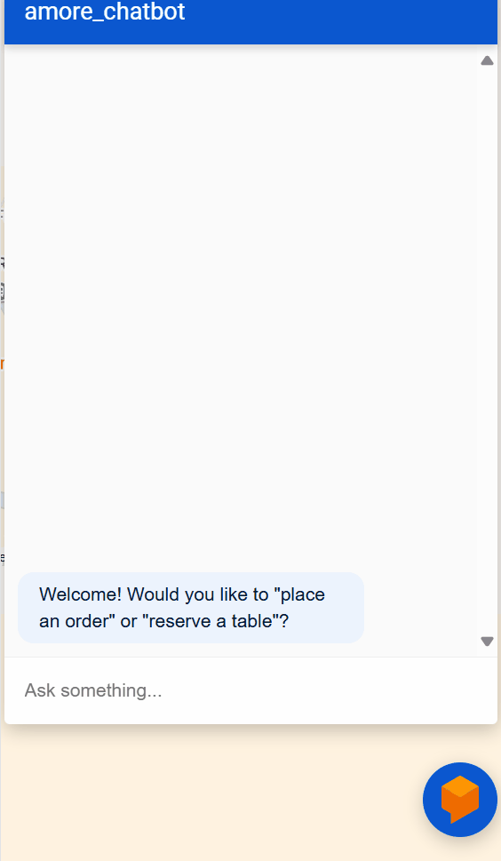
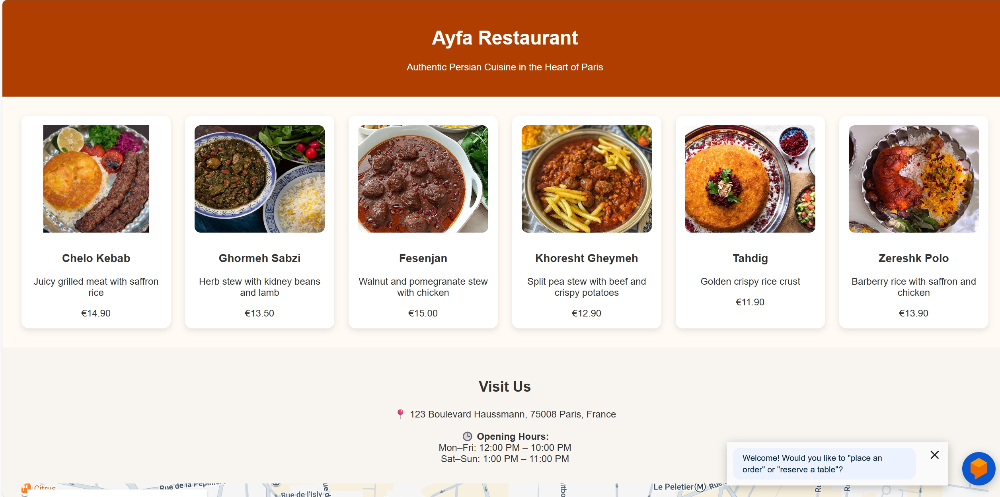

# 🍽️ Ayfa Restaurant — Persian Cuisine Chatbot Demo

Welcome to **Ayfa Restaurant**, a demo project that brings a fictional Persian restaurant to life through a rich user interface and an intelligent, Dialogflow-powered chatbot assistant.  
This is not just a static website — it's an interactive showcase of how AI and frontend development can work together to create a seamless customer experience.

### 🤖 What Can the Chatbot Do?

- 🗓️ Make and confirm **table reservations**  
- 📦 Help customers **track orders**  
- ❌ Handle **order & reservation cancellations**  
- 📲 Send **WhatsApp confirmations** using **Twilio API**

> ⚠️ **Note:** This is a fictional project designed to demonstrate my ability to combine front-end development, API integration, and chatbot design.

---

## ✨ Key Features

- 🧠 **Dialogflow AI Chatbot** — Embedded right into the site, responds in real-time  
- 💬 **WhatsApp Notifications via Twilio** — Instant updates & confirmations  
- 🍽️ **Traditional Persian Menu UI** — Styled with modern, responsive HTML/CSS  
- 📍 **Google Maps Embed** — For real-world-like location display  
- ⭐ **Customer Reviews Section** — Enhances realism and UI quality

---

## 💡 Technologies Used

| Frontend           | Backend & AI            |
|--------------------|------------------------|
| HTML5 / CSS3       | Google Dialogflow (ES) |
| Vanilla JavaScript  | Flask (Python Webhook) |
| Responsive Design  | Twilio WhatsApp API    |
| Google Maps Embed  | RESTful Communication  |

---

## 🤖 Chatbot Showcase

The chatbot is powered by **Dialogflow**, linked to a Flask webhook, and connected to **Twilio's WhatsApp API**. It supports multiple real-world customer intents:

- `Reserve Table`  
- `Track Order`  
- `Cancel Order`  
- `Cancel Reservation`

It also handles:
- User input validation (e.g., time/date, phone numbers)
- Message formatting & response logic
- External API calls for WhatsApp messaging

> 🎬 Want to see it in action? Watch this chatbot flow in the demo GIF below:



---

## 📷 Screenshots

A quick glance at the UI:




---

## 🧪 How to Run This Project

```bash
# Clone the repository
git clone https://github.com/fatemeh-mndz/Chatbot_for_Resturant.git
cd Chatbot_for_Resturant

# Optional: set up virtual environment if backend exists
python3 -m venv env
source env/bin/activate
pip install -r requirements.txt

# Run Flask webhook (if used)
python app.py


